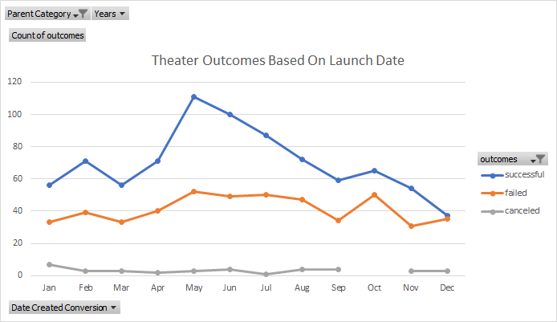

# Kickstarting with Excel

## Overview of Project

### Purpose

The purpose of this project is to analyze data from Kickstarter to make conclusions about optimal Kickstarter campaign factors for a friend who wants to launch a Kickstarter campaign for a theatrical play. We will specifically be looking at how the launch date of a campaign and the initial goal affect the likelihood of a successful campaign.

## Analysis and Challenges

### Analysis of Outcomes Based on Launch Date

The line graph above shows the month that a theater campaign was launched on the x-axis, along with the number of campaigns on the y-axis. Campaigns are split into three groups: successful, failed, and canceled. The graph shows that very few theater campaigns are canceled, and the number of canceled campaigns stays fairly consistent year-round. In any given month, there are more successful theater campaigns than failed theater campaigns. The number of failed theater campaigns stays fairly consistent year-round, but the number of successful theater campaigns appears to increase heavily in the summer months.

### Analysis of Outcomes Based on Goals

The line graph above shows the initial goal set by theatrical play campaigns on the x-axis, along with the number of campaigns on the y-axis. Campaigns are again split into three groups: successful, failed, and canceled. The graph shows that there were no theatrical play campaigns that were canceled, regardless of their initial goal. The graph roughly shows that theatrical play campaigns are most successful when they have lower initial goals. Medium to high initial goals for the most part result in failed campaigns.

### Challenges and Difficulties Encountered

## Results

- What are two conclusions you can draw about the Outcomes based on Launch Date?

One conclusion that we can draw about the outcomes based on launch date is that the best time to launch a campaign is between the months of May and July. These three months resulted in the greatest number of successful theater campaigns. Conversely, another conclusion that we can draw is that the worst time to launch a campaign is between the months of November and January. These three months resulted in the lowest number of successful theater campaigns.

- What can you conclude about the Outcomes based on Goals?

We can conclude that we have the largest chance for a successful theatrical play campaign if we set our initial goal to be low, preferably $5,000 or below. Almost 80% of theatrical play campaigns are successful when the initial goal is below $5,000.

- What are some limitations of this dataset?

This dataset does not include some factors that could contribute to a Kickstarter campaign's success. One of those factors is marketing/social media. The manner in which a Kickstarter campaign is marketed and spread around social media surely affects the likelihood of its success. Similarly, the person or group behind the Kickstarter campaign is also important. A Kickstarter campaign launched by a famous celebrity who already has a following is very likely to receive more pledged money than a Kickstarter campaign launched by an average person. These kinds of factors could be tough to codify into a database but they could be potentially very important in determining a campaign's success.

- What are some other possible tables and/or graphs that we could create?

There are many different tables or graphs that we could create that could help us analyze what makes a Kickstarter campaign successful. We could analyze whether the length of a campaign affects how likely it is to be successful. We could create a line graph to help us visualize what the optimal length for a campaign is. 
