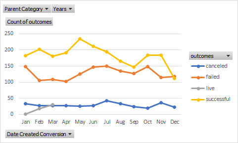
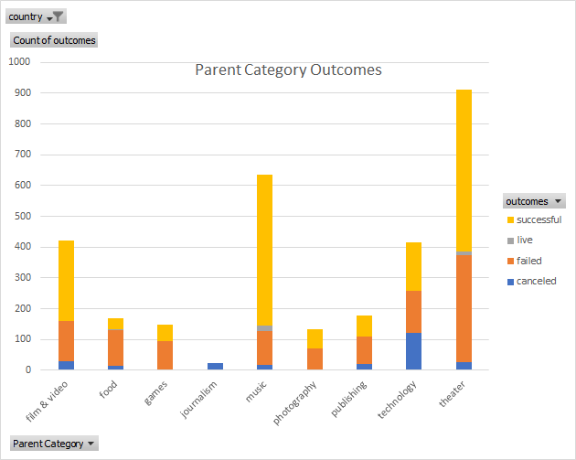

# An Analysis of Kickstarter Campaigns
Performing analysis on Kickstarter data to uncover trends

As you can see, the months with the most successful Kickstarter campaigns are May and June.

Over 50% of Theater Kickstarter campaigns are successful.

I would recommend that Louise launches her Kickstarter campaign in May.
