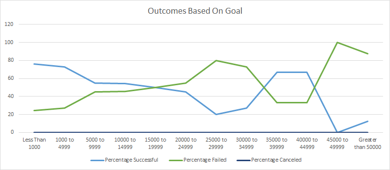

# Kickstarting with Excel

## Overview of Project

### Purpose

The purpose of this project is to analyze data from Kickstarter to make conclusions about optimal Kickstarter campaign factors for a friend who wants to launch a Kickstarter campaign for a theatrical play. We will specifically be looking at how the launch date of a campaign and the initial goal affect the likelihood of a successful campaign.

## Analysis and Challenges

### Analysis of Outcomes Based on Launch Date

The line graph above shows the month that a theater campaign was launched on the x-axis, along with the number of campaigns on the y-axis. Campaigns are split into three groups: successful, failed, and canceled. The graph shows that very few theater campaigns are canceled, and the number of canceled campaigns stays fairly consistent year-round. In any given month, there are more successful theater campaigns than failed theater campaigns. The number of failed theater campaigns stays fairly consistent year-round, but the number of successful theater campaigns appears to increase heavily in the summer months.

### Analysis of Outcomes Based on Goals

The line graph above shows the initial goal set by theatrical play campaigns on the x-axis, along with the number of campaigns on the y-axis. Campaigns are again split into three groups: successful, failed, and canceled. The graph shows that there were no theatrical play campaigns that were canceled, regardless of their initial goal. The graph roughly shows that theatrical play campaigns are most successful when they have lower initial goals. Medium to high initial goals for the most part result in failed campaigns.

### Challenges and Difficulties Encountered

## Results

- What are two conclusions you can draw about the Outcomes based on Launch Date?
-     nsaindaid

- What can you conclude about the Outcomes based on Goals?

- What are some limitations of this dataset?

- What are some other possible tables and/or graphs that we could create?
